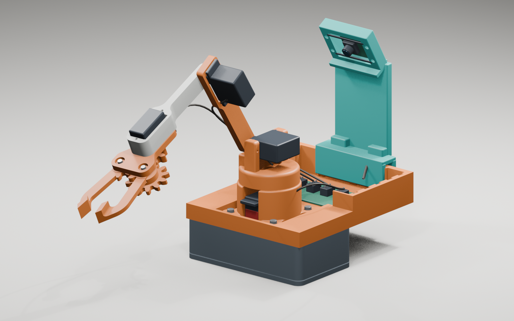

# Mini Robot Arm for XIAO ESP32-S3

一套可打印、可校准、可通过浏览器控制的四轴桌面机械臂。这个仓库记录原始模型、本地结构改版、XIAO ESP32-S3 固件、网页控制台和验证脚本。



## 已实现

- XIAO ESP32-S3 控制四个舵机：底座、大臂、小臂和夹爪。
- 手机或电脑连接机械臂热点后，通过 `http://10.10.10.1` 控制。
- 网页显示当前角度、目标角度和已保存的 Home 角度。
- 支持 1°、5°、10° 微调，Home 试运行、保存和恢复默认值。
- Home 姿态写入 ESP32 闪存，重新上电后仍然保留。
- 关节软限位和渐进移动，降低直接撞到机械极限的风险。
- 提供不连接硬件的本地 UI 模拟预览。
- 保存舵盘槽、MG90S 底座避让和 XIAO ESP32-S3 Sense 摄像头支架的修改文件与脚本。

## 接线

| 关节 | XIAO 引脚 | GPIO | 舵机电源 |
| --- | --- | ---: | --- |
| 底座左右 LR | `D2` | 3 | 外部稳定 5V |
| 大臂前后 FB | `D3` | 4 | 外部稳定 5V |
| 小臂上下 UD | `D4` | 5 | 外部稳定 5V |
| 夹爪 Grip | `D5` | 6 | 外部稳定 5V |

四个舵机的红线接外部 5V 正极，黑色或棕色线接外部电源负极。**外部电源负极必须再接到 XIAO 的 GND。** XIAO 可以由 USB-C 单独供电；不要用 XIAO 的 3.3V 引脚给舵机供电，也不要把 2S 锂电池的原始 7.4V 直接接入舵机。

接线图见 [`代码/Circuit_bb.png`](代码/Circuit_bb.png)。

## 编译和烧录

Arduino IDE 中安装 ESP32 开发板支持与 `ESP32Servo`，开发板选择 `XIAO_ESP32S3`，打开：

`代码/91_Robot_Arm_ESP32/91_Robot_Arm_ESP32.ino`

Arduino CLI 示例：

```powershell
arduino-cli compile --fqbn esp32:esp32:XIAO_ESP32S3 代码/91_Robot_Arm_ESP32
arduino-cli upload -p COM8 --fqbn esp32:esp32:XIAO_ESP32S3 代码/91_Robot_Arm_ESP32
```

端口号按本机 `arduino-cli board list` 的结果修改。第一次通电和烧录后测试时，让机械臂悬空并从 1° 微调开始。

## 使用网页控制台

1. 连接 Wi-Fi `ESP32 Robot`，密码 `12345678`。
2. 浏览器打开 `http://10.10.10.1`。
3. 先选择 1° 步长，逐个关节确认运动方向与安全范围。
4. 在“开机姿态”中填写角度，先点“试运行这组角度”。
5. 确认结构没有顶住后，再点“保存为开机姿态”。

网页显示的是程序输出给舵机的角度，不是传感器测得的绝对角度。舵盘偏一个齿时，软件显示 90°，实物也可能不水平。

## 本地预览界面

Windows 可双击 `启动前端预览.cmd`，或运行：

```powershell
python 代码/91_Robot_Arm_ESP32/preview_server.py --open
```

访问 `http://127.0.0.1:8765`。模拟服务器直接读取固件中的 `web.h`，所有动作只修改内存中的模拟角度，不会驱动真实舵机。

## 3D 文件和改版

- `3d打印件/`：原模型 STL 和随附 PDF。
- `3d打印件/舵盘槽调整/`：arm-1、arm-2 槽口放宽版、试装件、Blender 工程和脚本。
- `3d打印件/圆盘适配检查/`：MG90S 外壳避让试配件与几何检查。
- `3d打印件/拓竹导入/`：毫米单位的未切片 3MF。
- `3d打印件/摄像头支架改造/`：XIAO ESP32-S3 Sense 摄像头支架 STL、工程和生成脚本。
- `3d打印件/整机组装演示/`：装配场景、渲染图与可复现脚本。

这些几何改版中有一部分基于估算尺寸，仓库中的网格检查不等同于实物装配验证。打印完整件前，优先打印小试装件。

## 来源与许可

机械臂原模型来自 Arun Kumar 的 [Robotic Arm with a base for components](https://www.printables.com/model/1596575-robotic-arm-with-a-base-for-components)，基座等改版资料标注 RACBOTS。随附资料将模型标记为 [CC BY-SA 4.0](LICENSES/CC-BY-SA-4.0.txt)，本仓库保留署名，并以同一许可发布模型衍生文件。

Arduino 原始项目署名为 [Tech Talkies](https://www.youtube.com/@techtalkies1)，相关教程为 [ESP32 Robot Arm](https://www.youtube.com/watch?v=Qdebit3DgCE)。上游代码没有随附明确的开源许可证，因此本仓库不擅自为其指定许可证。详细边界见 [`NOTICE.md`](NOTICE.md)。

本地改动记录见 [`CHANGELOG.md`](CHANGELOG.md)。

