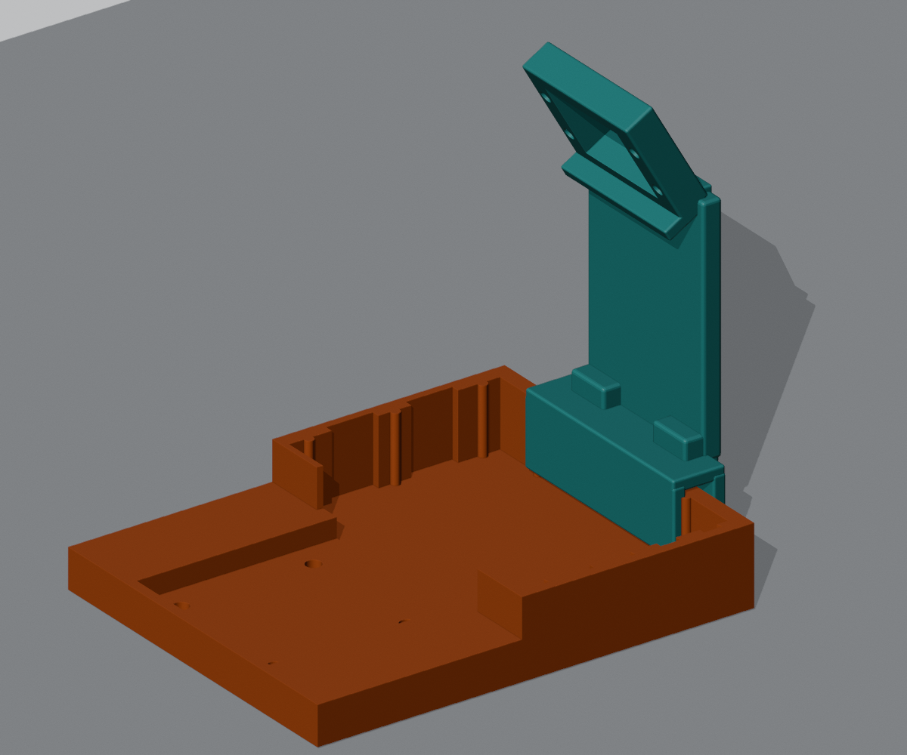

# 迷你机械臂 + ESP32 摄像头支架改造实施

> 版本：V1 试装方案（2026-09-27）  
> 目标：在原始 1596575 机械臂模型上增加固定式摄像头安装结构。按用户已确认的 XIAO ESP32S3 Sense 设计，让摄像头从固定视角观察工作区；成品叠板、镜头和排线的精确尺寸仍需实测。  
> 当前阶段：V1 支架模型已生成并完成软件网格检查；尚未打印和装配验证。

## 1. 已确认的基础

- 原始机械臂来源为 Printables 模型 [Robotic Arm with a base for components](https://www.printables.com/model/1596575-robotic-arm-with-a-base-for-components)。本地资料中的 PDF 文件名也带有 `1596575` 和同名标题。
- 本地模型位于 `3d打印件/`，包括原始 STL、Blender 工程、修正版 STL 和拓竹 3MF。
- 原机械臂使用四个 MG90S 舵机，原接线保持不变：
  - D2 / GPIO3：底座左右；
  - D3 / GPIO4：大臂前后；
  - D4 / GPIO5：小臂上下；
  - D5 / GPIO6：夹爪。
- 舵机继续使用外部稳定 5V，舵机 GND 与 XIAO GND 共地；不使用 XIAO 3V3 给四个舵机供电。
- 用户已确认使用 XIAO ESP32S3 Sense。软件侧已有 Sense 摄像头配置，摄像头使用的 GPIO 与机械臂 GPIO3/4/5/6 分开。
- 当前照片可供判断安装位置和走线，不能作为精确尺寸图。最终卡槽要以 XIAO Sense 成品叠板的长、宽、总厚度，以及镜头位置和排线方向为准。

## 2. V1 结构决定

V1 采用“固定在底座后方的摄像头塔”方案：

1. XIAO Sense 摄像头组件固定在机械臂底座后侧或侧后方，并保持与主控板的原有连接；
2. 摄像头托框向前下俯 30°，让镜头朝向桌面工作区；实际视野仍以拍照结果为准；
3. 摄像头位置相对工作台保持不动，方便后续做坐标标定；
4. 支架做成独立可拆卸件，不直接切削或覆盖 `base1.stl`、`base-2.stl`、`arm-1.stl`、`arm-2.stl`；
5. V1 通过夹持结构搭在 `base_breadboard.stl` 的后墙上，后续根据实物墙厚调整夹口；
6. 使用开放式托架和绑带孔固定摄像头组件，安装时核对 USB-C、排线、舵机线和散热空间。

固定摄像头比把摄像头装到大臂、前臂或夹爪上更适合第一版。运动关节上的摄像头会增加末端重量、排线弯折和动态标定工作量。

## 3. V1 模型输出

生成文件放在 `3d打印件/摄像头支架改造/`：

- `xiao_sense_camera_mast_v1.blend`：可继续修改的 Blender 工程；
- `xiao_sense_camera_mast_v1.stl`：单件打印模型；
- `xiao_sense_camera_mast_v1_preview.png`：结构预览；
- `build_camera_mast_v1.py`：可复现的 Blender 建模脚本；
- `validation.json`：尺寸、孔位和网格检查结果。

V1 使用开放卡槽和绑带孔，尚未按实物叠板做紧配外壳。XIAO Sense 可以参考 Seeed 官方 DXF 尺寸，但排针、连接器、镜头和排线构成的总空间仍需实测。

当前模型参数：

| 项目 | V1 参数 | 使用说明 |
|---|---:|---|
| 支架外形 | 54 × 23.563 × 103.381 mm | 宽 × 深 × 高，按毫米导入切片软件 |
| 摄像头框开口 | 26 × 21 mm | 是托架开口，不代表板卡可用安装空间已确认 |
| 相机托框下俯角 | 30° | 固定角度，后续可修改脚本 `CAMERA_TILT_DEG` |
| 绑带孔 | 4 个，直径 3.1 mm | 左右框边各两个；使用能穿过孔的小绑带，不压镜头或排线 |
| 底座夹口 | 7.1 mm | 源模型后墙约 4 mm，留有约 3.1 mm 总余量 |
| 底座夹口适配 | 待试装 | 当前不能保证夹紧；需使用合适垫片，或按实测墙厚修改脚本参数 |
| 内侧加强筋避让 | 按原底座轮廓切出凹槽 | 刀具前移 0.3 mm，前爪局部留间隙；未改原底座 |

先在切片软件中截取夹口/托架，做局部试装并检查松紧，再考虑完整支架。不能依靠 3.1 mm 的空隙直接固定摄像头，否则支架晃动会改变视角，使后续标定失效。

图中橙色是原电子舱底座，青绿色是新增支架。STL 只包含青绿色部分；Blender 工程中保留橙色底座供装配参考，没有把它改写回原文件。图中没有装入主控板、摄像头或完整机械臂。

打印文件按毫米使用；STL 本身不带单位，导入后应核对上表尺寸。当前模型保留原底座坐标，切片时使用“放到打印床”调整位置。托盘和夹口存在悬空区域，切片时核对支撑及桥接，不提供未经切片/真机验证的 G-code。先用常用的 0.2 mm 层高做小件试装；完整件的壁数、填充和支撑要结合打印机与材料确认。

导出后的 STL 已重新导入校验：1 个连通实体、2812 个三角面、非流形边 0、零长度边 0、零面积面 0，实体体积约 26026 mm³。中心窗口和四个绑带孔共 90 条双向采样射线无遮挡；支架与原电子舱底座的静态布尔交集为 0。检查结果保存在 `validation.json`，脚本重新生成时会再次执行检查。这说明网格、采样通孔和名义底座位置通过检查，不代表镜头真实视场、夹紧力、承重、切片结果或真机装配已验证。

官方尺寸参考：

- XIAO ESP32S3 尺寸 DXF：<https://files.seeedstudio.com/wiki/SeeedStudio-XIAO-ESP32S3/res/XIAO_ESP32S3_v1.1_Dimensioning.dxf>
- XIAO Sense 扩展板顶/底部 DXF 可从 Seeed XIAO ESP32S3 资源页获取。

## 4. 软件实施顺序

本轮只改造模型并记录方案，没有修改 ESP-Claw 软件。仓库中已有摄像头拍照和颜色/运动检测的底层能力；网页摄像头预览、目标位置到机械臂动作的转换，以及自动抓取闭环尚未完成。下面是后续实施顺序，不是本轮已交付功能。

### 阶段 A：摄像头可用性

- 在 ESP-Claw 中打开摄像头；
- 调用 `take_picture` 保存一张 JPEG；
- 后续在网页增加拍照和预览入口；
- 确认镜头方向、曝光和工作区范围。

### 阶段 B：简单视觉

- 在工作区放置颜色明显的方块；
- 先用颜色检测得到目标像素位置；
- 网页同时显示原图、目标框和候选位置；
- 保留人工确认按钮。

### 阶段 C：坐标和动作

- 在工作台放置四个标记点；
- 建立像素坐标到工作台平面坐标的转换；
- 测量机械臂关节零点、臂长和安全工作范围；
- 实现目标位置到四路舵机角度的转换；
- 先执行“移动到目标上方”，再执行夹爪动作。

### 阶段 D：抓取反馈

- 记录抓取前后的照片；
- 检查目标是否仍在原位置；
- 增加停止、超时和人工接管；
- 再考虑自动执行，不把一次识别结果直接当成绝对正确的动作。

## 5. 验证顺序

1. 支架先单独试装，确认夹口、托架开口和固定方式；夹口松动时先加合适垫片或修改参数；
2. 装上实际主控板和摄像头，确认 USB-C、排线和 SD 卡仍可使用；
3. 机械臂断电时先检查静态间隙和走线；不要强行扳动舵机。之后按已校准的小范围、低速动作逐步检查各关节与支架的干涉；
4. 仅给 XIAO 通电，确认摄像头能拍照；
5. 单独给舵机外部 5V，确认共地；
6. 先用网页滑块测试机械臂，再测试颜色识别；
7. 完成后续标定和动作软件后，再进行低速、小范围、人工确认的抓取测试。

## 6. 需要实物复核的尺寸

- XIAO ESP32S3 Sense 成品叠板的实际长、宽、总厚度，包括已焊排针和连接器；
- 实际摄像头镜头相对板边的位置，以及镜头外径和凸出高度；
- 实际摄像头连接线的长度、弯曲方向和接头高度；照片里的白色线材不作为已确认的摄像头排线；
- 原底座后墙的实际厚度、高度和附近凸台/线材占用；若后续采用螺丝固定，还需核对可用孔中心距；
- 摄像头需要覆盖的工作区大小；
- 机械臂最大摆动范围和支架的避让距离。

因此，V1 STL 是试装模型，不等同于已经验证可以直接打印装配的最终件。实物测量和一次小件打印通过后，再生成 V2 紧配版和外观封闭版。

## 7. 照片与尺寸依据

- 板型按用户确认的 XIAO ESP32S3 Sense 处理，不根据这张照片另猜型号。
- 支架尺寸来自原始模型和可调整的 V1 设计参数；照片没有标尺，不能从照片直接量出可靠的孔距和配合公差。
- V2 紧配件需要成品叠板、摄像头和排线接口的实测长宽厚及安装方向，再锁定卡扣与孔位。

## 8. 当前边界

- 本次只增加摄像头安装模型并记录实施方案，没有改动软件和四个舵机的物理接线。
- 摄像头拍照、颜色/运动检测等底层能力已有；网页预览和“识别目标→坐标标定→逆运动学→抓取→结果反馈”仍需后续实现和真机验证。
- 模型尚未实物打印、试装，也未完成完整机械臂运动包络和实际视场验证。当前夹口有余量，不能把 V1 当成已经适配的最终件。

## 9. 整机拼装预览与动画（2026-09-27）

已将本地底座、两段臂、夹爪及新增支架组合为 Blender 示意装配场景，并提供 24 秒中文分步动画。入口：[整机组装演示](3d打印件/整机组装演示/组装演示.html)。文件、时间线、来源与验证范围见同目录 [使用说明](3d打印件/整机组装演示/使用说明.md)。

渲染包含整机、爆炸图、侧视图与相机特写；舵机、XIAO Sense 叠板、镜头、紧固件和线材是外观代理，未做厂家 CAD 级复刻。原接线和摄像头支架 STL 没有因演示而改变，动画不控制真机，也不代表整个运动范围已通过碰撞检查。
